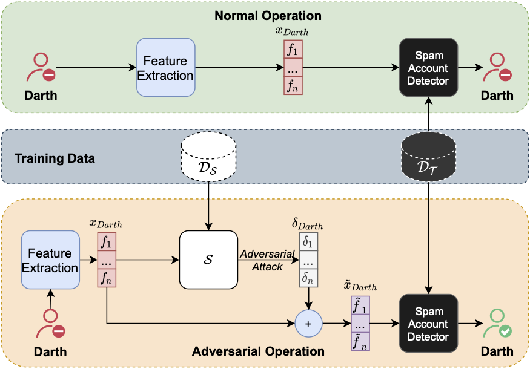
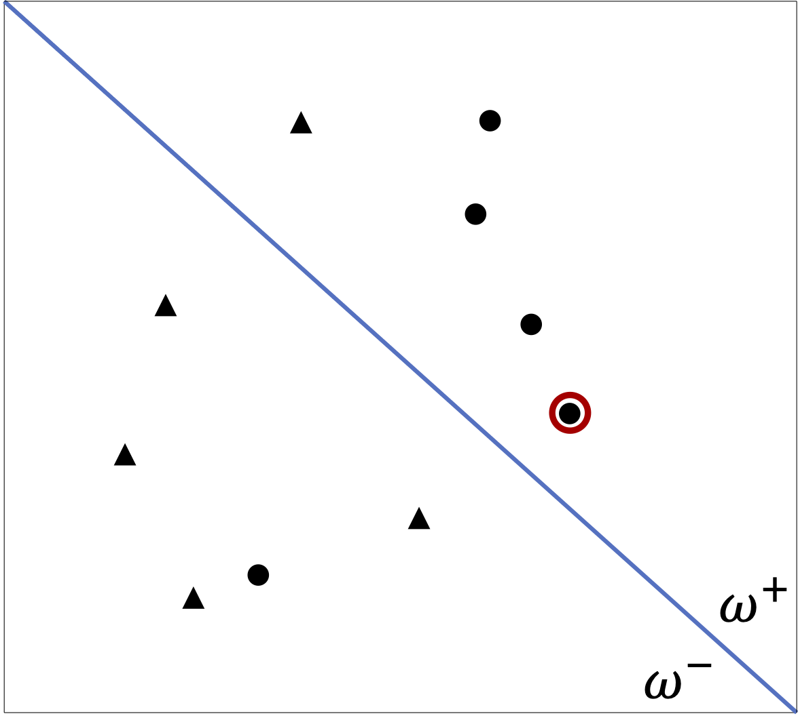
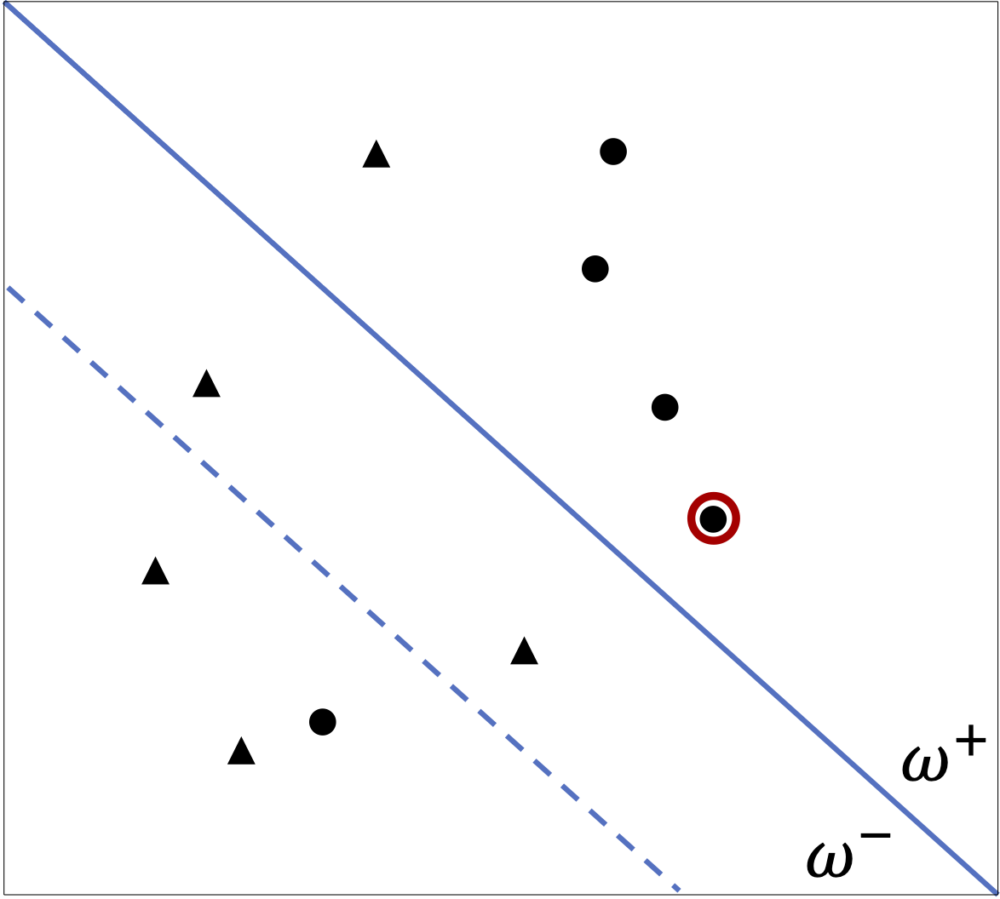
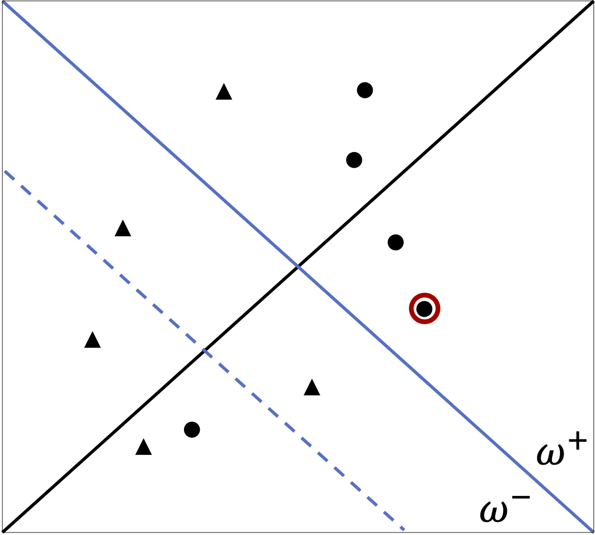
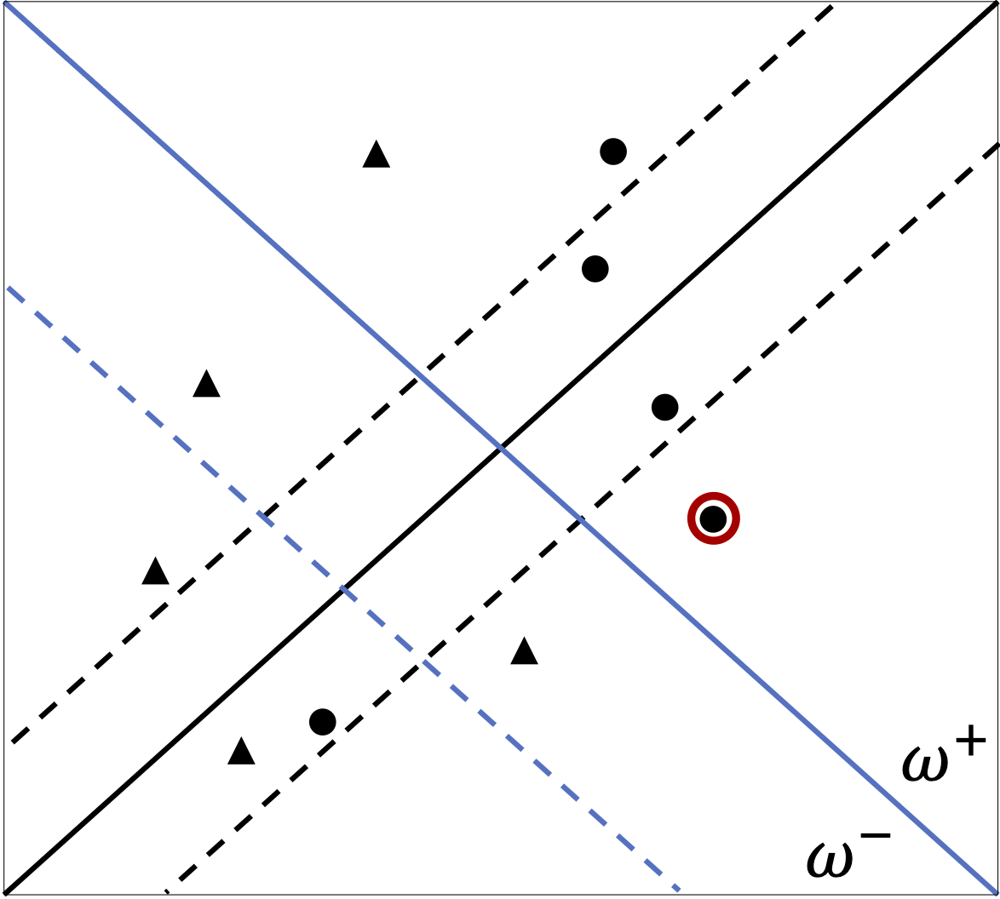
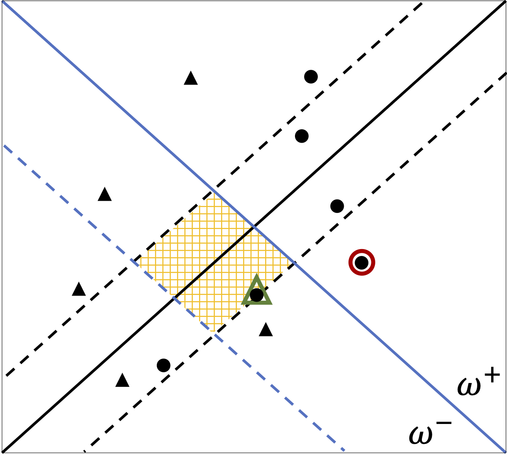

**AdverSPAM: Adversarial SPam Account Manipulation in Online Social Networks**
==========================================================

AdverSPAM is an Adversarial Machine Learning attack aiming at preserving statistical correlations and semantic dependences among features.
It has been thought for operating in a Spammer Account detection scenario in Online Social Networks, however, it can be generalized to other scenarios as well.

## *Background* 


<div>
<p align="center">

</p>
</div>


AdverSPAM follows the general structure of query-limited setting black-box attack adversarial attacks.


|    |    |  |  |  | 
|:-----------------------------------------:|:-----------------------------------------:|:---------------------------------------:|:---------------------------------------:|:---------------------------------------:|
|                    (a)                    |                    (b)                    |                   (c)                   |                   (d)                   |                   (e)                   |


Simplified example of binary classification with only two features showing the AdverSPAM operation. 

(a) The decision boundary (blue line) separates spammers (circles) from genuine users (triangles). The goal of the attack is to project one chosen spammer sample (red) into the opposite region by crossing the decision boundary. 

(b) The adversarial sample must be generated within a certain distance (dashed blue line) from the decision boundary, which depends on a parameter $`\psi`$. 

(c) The regression line (black) provides a good approximation of the correlation between the spammer samples. 

(d) In order to preserve the nature of the input, the feasible region (yellow area) for the adversarial sample is further constrained by a margin around the regression line. 

(e) The adversarial sample (green triangle) is finally computed by solving the optimisation problem within the feasible region.

## *Setup*

Run the following snippet in a Unix terminal to install adverspam.  

```
git clone https://github.com/agiammanco94/AdverSPAM
cd AdverSPAM
pip install -e . 		# install in editable mode  
```

In order to test the correct installation of the adverspam module, the following example script can be run by opening a Unix terminal in the project root folder and running:

```
python adverspam/example/toy_example.py
```
this is a toy example using the [Iris dataset](https://archive.ics.uci.edu/dataset/53/iris), showing how to invoke adverspam attack.

We recommend instantiating and using a virtual environment prior to the installation of adverspam package.

## *Tested-Systems*

Make sure that you are operating in a Python >= [3.8](https://docs.python.org/3.8/) environment.
The project has been tested with Python v. 3.10.9 on macos v. 10.15.7; it has also been tested on Python v. 3.10.6 on Linux Ubuntu 22.04.2 LTS.

## *Requirements*

- [`numpy`](https://numpy.org/devdocs/) v. 1.25.1
- [`pandas`](https://pandas.pydata.org/docs/) v. 2.0.3
- [`scipy`](http://scipy.github.io/devdocs/) v. 1.11.1

### *Soft-Dependencies*

These are the dependencies useful for running the toy example in python adverspam/example/toy_example.py:

- [`scikit-learn`](https://scikit-learn.org/stable/index.html) v. 1.3.0


## *Documentation*

Code is documented with both [type hints](https://docs.python.org/3/library/typing.html) and [Google docstrings](https://sphinxcontrib-napoleon.readthedocs.io/en/latest/example_google.html).


## *License*

The project is licensed under the [BSD 3-Clause license](https://github.com/agiammanco94/AdverSPAM/blob/main/LICENSE.txt).

## *BibTeX-Citation*

If you use adverspam in your research, we would appreciate a citation to the following paper ([bibtex](/docs/references/Adverspam_bibitem.bib))

```
@article{}
```